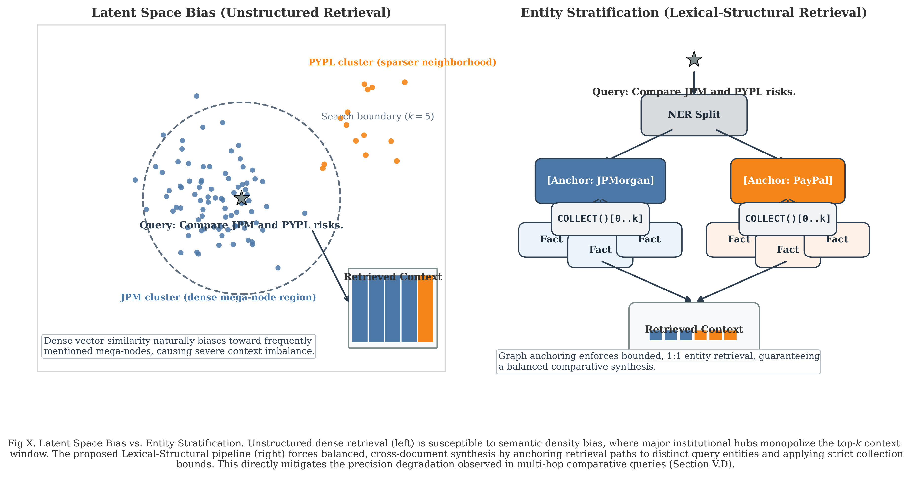
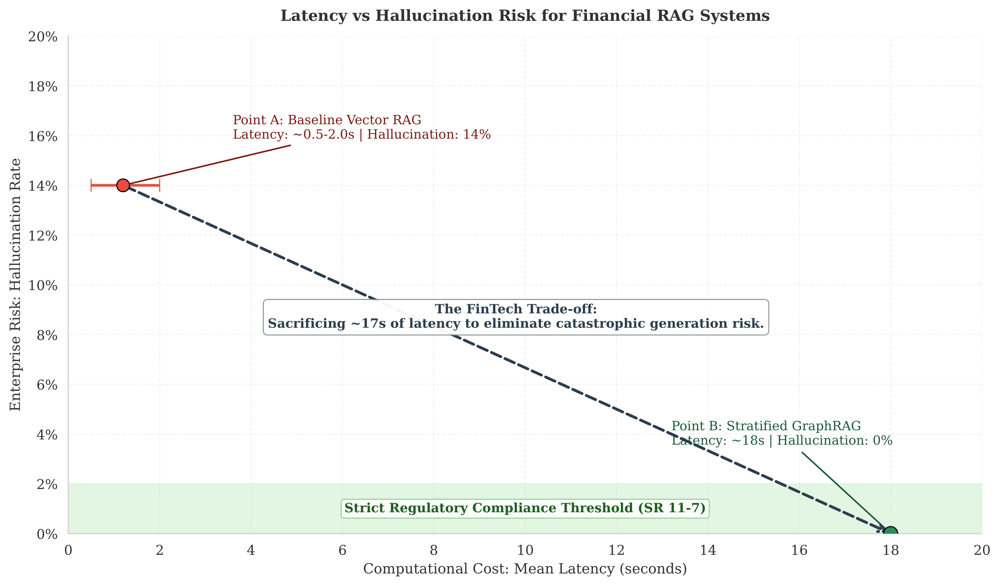

[](https://deepwiki.com/AadilUsmani/Lexical_Graph_RAG)

# Deterministic Data Fusion for FinTech: Formalizing Stratified Knowledge Graphs for Zero Hallucination Compliance

[](paper.pdf)
[](paper.tex)
[](https://www.python.org/)
[](https://neo4j.com/)

This repository contains the official code, evaluation suite, and experimental artifacts for **Lexical-Structural GraphRAG: Multi-Source Heterogeneous Data Fusion for SEC 10-K Compliance Analysis**.

---

## 📄 Paper Summary & Links

- **Paper Title:** *Deterministic Data Fusion for FinTech: Formalizing Stratified Knowledge Graphs for Zero Hallucination Compliance*
- **Authors:** Muhammad Adil Usmani and Muhammad Hassan Siddiqui (Department of Computer Science, University of Central Punjab, Lahore, Pakistan)
- **Full PDF:** [Deterministic_Data_Fusion_for_FinTech.pdf](Deterministic_Data_Fusion_for_FinTech.pdf) / [paper.pdf](paper.pdf)
- **LaTeX Source:** [Deterministic_Data_Fusion_for_FinTech.tex](Deterministic_Data_Fusion_for_FinTech.tex) / [paper.tex](paper.tex)

---

## 🏛️ System Architecture & Framework Diagrams

### 1. End-to-End Pipeline & Architectural Comparison
Comparison between Baseline Vector RAG (prone to context bloat and hallucination) and our proposed Lexical-Structural GraphRAG framework enforcing strict lexical anchoring, bounded traversal, and refusal-gated synthesis:

<p align="center">
  
</p>

### 2. Hybrid Retrieval & Score Fusion Mechanism
Integration of dense vector-based semantic search with BM25 keyword matching (Score Fusion) to balance lexical precision and semantic recall:

<p align="center">
  
</p>

### 3. Structured Knowledge Graph Topology
Graph topology mapping entities, obligations, risk factors, and metrics into auditable, typed predicates linked directly to `source_chunk` provenance:

<p align="center">
  
</p>

### 4. Signal-to-Noise Ratio & Context Bloat Mitigation
Triplet Atomicity increases relevant fact density from 18% to 85%, eliminating extraneous prose and reducing prompt token load by 65–75%:

<p align="center">
  
</p>

---

## 📊 Experimental Results & Visualizations

### 5. Latent Space Bias vs. Entity Stratification
Dense retrieval suffers from semantic density bias, whereas lexical-structural fusion ensures balanced retrieval across multi-hop queries:

<p align="center">
  
</p>

### 6. Latency vs. Hallucination Risk Trade-Off
Our framework achieves 0% hallucination on unretrieved context through deterministic refusal gating, fulfilling strict SR 11-7 regulatory compliance requirements:

<p align="center">
  
</p>

### 7. Precision@k Degradation & Complexity Analysis
GraphRAG maintains stability across retrieval depths and query complexity levels, whereas baseline Vector RAG degrades sharply:

| Precision@k Degradation | Architectural Behavior by Complexity |
| :---: | :---: |
|  |  |

### 8. Cumulative Recall & Implicit Query Bridging
Cumulative evidence accumulation curve across retrieval depth ($K$) alongside MRR performance on implicit terminology bridging queries:

| Cumulative Recall ($K$) | MRR for Implicit Queries |
| :---: | :---: |
|  |  |

---

## 📁 Repository Structure

```text
.
├── src/
│   ├── fetch_data.py                           # Asynchronous SEC 10-K ingestion
│   ├── create_semantic_chunks.py               # Topic-boundary semantic chunking
│   ├── knowledge_graph_extractor.py            # LLM-driven ontology & triplet extraction
│   ├── network_builder.py                      # Entity resolution & PageRank optimization
│   ├── neo4j_ingestion.py                      # Neo4j property graph ingestion & indexing
│   ├── graph_rag_pipeline.py                   # Deterministic traversal & refusal-gated generation
│   ├── hybrid_engine.py                        # Dense + sparse vector/BM25 baseline engine
│   └── evaluation_metric_knowledge_graph.py    # Stratified GraphRAG metric evaluation
├── data/
│   ├── ground_truth.json                       # 35-query annotated evaluation benchmark
│   ├── sec_semantic_chunks_master.jsonl        # Master chunk corpus
│   ├── phase3_extracted_graph.jsonl            # Raw extracted graph triplets
│   ├── phase3_deduplicated_graph.json          # Deduplicated entity-relation graph
│   ├── phase3_5_final_knowledge_graph.json     # Final optimized knowledge graph
│   └── sec_data/                               # Parsed 10-K sections (JPM, PYPL, etc.)
├── evals/
│   ├── evaluation_metric.py                    # Benchmark evaluator for Vector RAG
│   ├── graphrag_evaluation_results.json        # GraphRAG benchmark execution results
│   └── eval_results/                           # Summary metrics & per-query logs
├── figures/
│   ├── pics/                                   # High-resolution PNG renderings
│   └── *.pdf                                   # Vector format publication plots
├── paper.tex                                   # Complete IEEEtran LaTeX manuscript
├── paper.pdf                                   # 9-page compiled publication PDF
├── visualization.py                            # Script to generate publication figures
└── requirements.txt                            # Project Python dependencies
```

---

## ⚡ Quickstart & Workflow

### 1. Environment Setup

```powershell
python -m venv .venv
.\.venv\Scripts\Activate.ps1
python -m pip install --upgrade pip
pip install -r requirements.txt
```

### 2. Configure Environment (`.env`)

Create a `.env` file in the root directory:

```env
# Azure OpenAI
AZURE_OPENAI_ENDPOINT=https://your-endpoint.openai.azure.com/
AZURE_OPENAI_API_KEY=your_azure_key
AZURE_OPENAI_API_VERSION=2024-12-01-preview
AZURE_OPENAI_CHAT_DEPLOYMENT_NAME=gpt-4o-mini
AZURE_OPENAI_EMBEDDING_DEPLOYMENT_NAME=text-embedding-3-small

# Neo4j Database
NEO4J_URI=bolt://localhost:7687
NEO4J_USER=neo4j
NEO4J_PASSWORD=your_neo4j_password
NEO4J_BATCH_SIZE=500
```

### 3. Pipeline Execution

```powershell
# Phase 1: Ingest SEC 10-K filings
python src/fetch_data.py

# Phase 2: Generate semantic chunks
python src/create_semantic_chunks.py

# Phase 3: Extract graph triplets using typed ontology
python src/knowledge_graph_extractor.py

# Phase 3.5: Canonicalization & PageRank optimization
python src/network_builder.py

# Phase 4: Ingest graph into Neo4j
python src/neo4j_ingestion.py

# Phase 5: Execute GraphRAG evaluation benchmark
python src/graph_rag_pipeline.py
python src/evaluation_metric_knowledge_graph.py

# Generate all figures
python visualization.py
```

---

## 👥 Authors & Maintainers

- **Muhammad Adil Usmani** — `muhammadaadilusmani@gmail.com`
- **Muhammad Hassan Siddiqui** — `hassansiddiqui0946@gmail.com`
- Department of Computer Science, University of Central Punjab, Lahore, Pakistan
